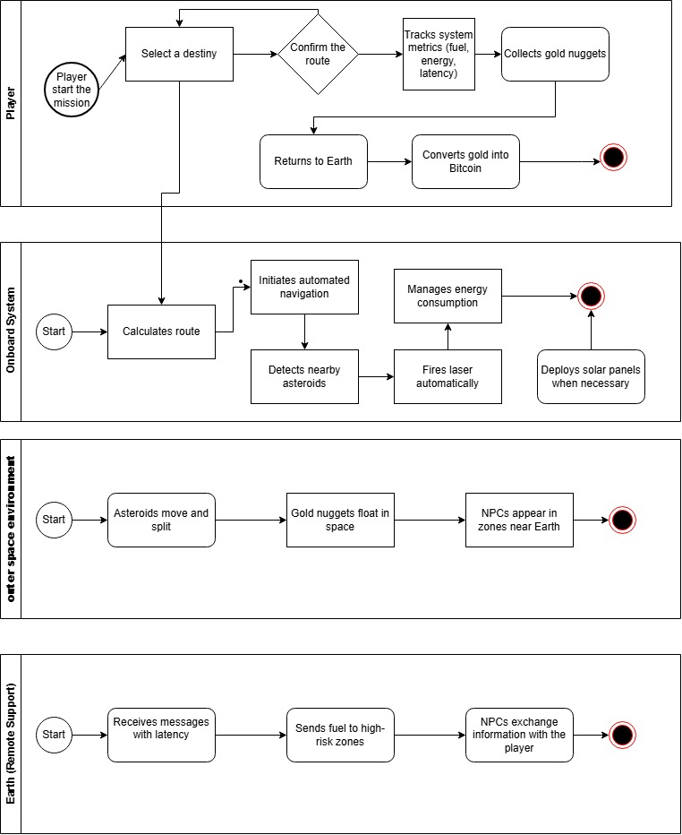
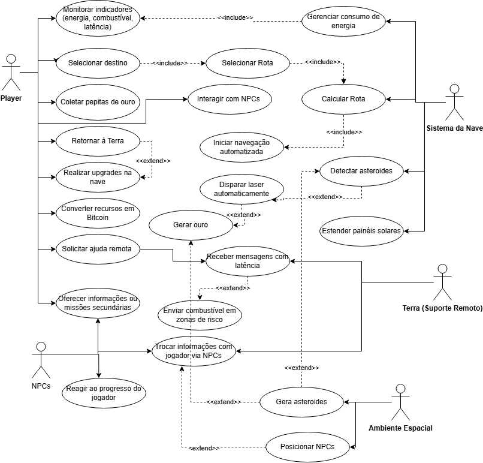

# Especificações do Projeto

Pré-requisitos: <a href="01-Documentação de Contexto.md"> Documentação de Contexto</a>

Nesta seção do documento, serão abordadas as especificações do projeto, fornecendo uma visão detalhada dos pré-requisitos, definição do problema, ideia de solução, [diagrama de personas](#personas), [histórias de usuários](#histórias-de-usuários), [requisitos funcionais](#requisitos-funcionais) e [não funcionais](#requisitos-não-funcionais), bem como as [restrições do projeto](#restrições). Para isso, serão utilizadas técnicas como entrevistas com stakeholders, análise de documentos de contexto, brainstorming e ferramentas de documentação de requisitos.

A seguir, será apresentado o resultado da análise e definição do problema, bem como uma proposta de solução a partir da perspectiva do usuário, alinhando as necessidades identificadas com os objetivos do projeto. O [diagrama de personas](#personas) será criado para representar os principais perfis de usuários envolvidos, enquanto as [histórias de usuários](#histórias-de-usuários) detalharão os requisitos de forma mais granular. Por fim, os [requisitos funcionais](#requisitos-funcionais) e [não funcionais](#requisitos-não-funcionais) serão identificados e documentados, juntamente com quaisquer restrições importantes para o projeto.

Este processo garantirá uma compreensão abrangente dos objetivos e requisitos do projeto, orientando o desenvolvimento da solução de forma eficaz e alinhada com as necessidades dos usuários e as diretrizes do projeto.

## Personas

As personas levantadas durante o processo de entendimento do problema são apresentadas na Figuras que se seguem.

|Nome | Idade | Profissão | Comportamento | Necessidades | Objetivo com o jogo|
|:--|:--|:--|:--|:--|:--|
|👨‍🚀 Genivaldo Alves – Jogador casual com interesse em estratégia | 34 anos | Analista de sistemas | Joga ocasionalmente, prefere jogos com desafios inteligentes e mecânicas estratégicas | Quer aprender jogando, sem depender de tutoriais externos | Sentir-se desafiado e engajado com mecânicas que vão além da simples destruição de asteroides|
|👩‍🏫 Marta Helena – Educadora que usa jogos como ferramenta de ensino|Idade: 45 anos|Professora de Ciências do Ensino Médio|Busca recursos didáticos inovadores para engajar os alunos|Ferramentas que simulem conceitos científicos de forma acessível|Utilizar o jogo como apoio pedagógico para ensinar física, navegação espacial e gestão de recursos|
|👩‍💻 Antonella Soares – Estudante e desenvolvedora iniciante|21 anos|Estudante de Ciência da Computação|Curiosa, gosta de explorar projetos open source e aprender com eles|Acesso ao código e documentação clara|Aprender sobre desenvolvimento de jogos e contribuir com melhorias|
|🧠 Rafael Torres – Gamer hardcore e entusiasta de automação|29 anos|Engenheiro de software|Joga com frequência, valoriza jogos complexos e personalizáveis|Mecânicas de automação e progressão estratégica|Explorar sistemas avançados e sentir evolução ao desbloquear funcionalidades|

## Histórias de Usuários

Com base na análise das personas forma identificadas as seguintes histórias de usuários:

| Nome                | EU COMO... `PERSONA`| QUERO/PRECISO ... `FUNCIONALIDADE`| PARA ... `MOTIVO/VALOR`|
|---------------------|---------------------|-----------------------------------|------------------------|
|👨‍🚀 Genivaldo Alves |jogador curioso e fã de jogos espaciais|entender os recursos disponíveis e como usá-los estrategicamente / acessar tutoriais interativos e dicas durante o jogo.| para que eu possa aprender jogando e me sentir desafiado sem ficar perdido|
|👩‍🏫 Marta Helena    |professora de ciências interessada em gamificação|que o jogo simule aspectos reais da exploração espacial/usar o jogo como apoio didático em sala de aula|para que meus alunos aprendam sobre física, navegação e gestão de recursos de forma divertida|
|👩‍💻 Antonella Soares |estudante de tecnologia apaixonada por jogos|entender como o jogo foi feito e como posso contribuir/acessar o código aberto e a documentação do projeto|para que eu possa aprender com o projeto e aplicar meus conhecimentos|
|🧠 Rafael Torres     |jogador experiente que gosta de jogos complexos|automatizar tarefas repetitivas como mineração e defesa/desbloquear módulos de automação conforme avanço no jogo|para que eu possa focar em estratégias mais avançadas e sentir progresso|

## 🔄 Modelagem do Processo de Negócio  
A modelagem do processo de negócio tem como objetivo representar os principais fluxos de interação entre os usuários e o sistema do jogo. Essa etapa é essencial para garantir que todas as funcionalidades estejam alinhadas com os objetivos do projeto e com as necessidades dos usuários identificadas nas personas.

### 📌 Análise da Situação Atual

O cenário atual dos jogos espaciais é dominado por títulos que priorizam ação rápida, gráficos avançados ou simulações altamente complexas. No entanto, poucos oferecem uma experiência acessível e educativa que una exploração, automação e economia digital em um ambiente interativo.

Jogos clássicos como *Asteroids* focam na destruição de objetos, enquanto simuladores modernos como *EVE Online* e *The Outer Wilds* exploram aspectos mais profundos de navegação e narrativa. Ainda assim, há uma lacuna entre esses extremos: falta uma proposta que combine jogabilidade estratégica com elementos realistas como:

- Navegação automatizada com seleção de destinos
- Comunicação com latência baseada na distância
- Gestão de energia solar e recarga por painéis
- Interação com NPCs com rotinas distintas
- Economia baseada em coleta e conversão de recursos

Além disso, a maioria dos jogos não simula situações como ajuda remota em zonas de risco, consumo energético por tipo de armamento, ou a necessidade de preparar a nave para receber suprimentos em movimento — elementos que fazem parte da realidade de missões espaciais e poderiam enriquecer a experiência do jogador.

O projeto *Asteroide-jogo* surge como uma resposta a essa lacuna, propondo uma solução que une jogabilidade envolvente, simulação realista e narrativa emergente, com foco em acessibilidade, criatividade e aprendizado.

### 📌 Descrição Geral da Proposta

Os processos de negócio simulados no jogo são realizados por meio de uma interface interativa, acessada pelo jogador através da nave espacial. O sistema é responsável por intermediar as ações entre o jogador, os elementos do universo (como asteroides, pepitas de ouro e NPCs) e os sistemas automatizados da nave.

A nave funciona como uma plataforma operacional que permite ao jogador:

- Selecionar destinos por meio de uma interface de busca inteligente
- Navegar automaticamente até o local escolhido
- Detectar e coletar recursos (pepitas de ouro) durante a missão
- Retornar à Terra para converter os recursos em Bitcoin
- Interagir com NPCs em zonas próximas à Terra para troca de informações
- Receber ajuda remota em zonas de risco, como combustível enviado pela Terra
- Gerenciar sistemas de defesa automatizada contra asteroides
- Controlar o consumo de energia e recarregar o capacitor por meio de painéis solares

Cada processo é representado por fluxos específicos dentro do jogo, como mostrado no diagrama de processos. Esses fluxos garantem que o jogador tenha uma experiência imersiva e estratégica, simulando desafios reais de exploração espacial, comunicação interestelar e sobrevivência em ambientes hostis.

### Overview do Processo

O processo de negócio é composto por dois processos principais: **agendamento do treinamento** e **realização do treinamento**. Além desses, há um processo de **cadastro de profissionais/cliente**, um **processo de cadastro de Pets** e **um processo de pagamento**. Como podemos ver no diagrama de processos a seguir.

### Processo 1 – Navegação Automatizada
O jogador acessa a interface de navegação da nave, digita o nome do destino ou escolhe por filtros (popularidade, distância, segurança). O sistema calcula a rota, inicia a navegação automatizada e exibe métricas como combustível, energia e latência de comunicação com a Terra.

### Processo 2 – Coleta e Conversão de Recursos
Durante a missão, o jogador coleta pepitas de ouro flutuantes. Ao retornar à Terra, o sistema converte os recursos em Bitcoin, que podem ser usados para upgrades da nave. O processo envolve colisão com pepitas, armazenamento interno e validação de conversão.

### Processo 3 – Defesa Automatizada
A nave detecta asteroides próximos por raio de proximidade. Se estiverem dentro do limite, o sistema dispara automaticamente um laser ou munição física, dependendo da energia disponível. O jogador pode configurar prioridades de defesa e monitorar o consumo energético.

### Processo 4 – Interação com NPCs
NPCs aparecem em zonas próximas à Terra. O jogador pode interagir com eles para obter informações, dicas ou missões secundárias. Os NPCs têm perfis variados (mineradores, turistas, técnicos) e não estão disponíveis em regiões distantes.

### Processo 5 – Suporte Remoto da Terra
Em zonas de risco, o jogador pode solicitar ajuda à Terra. A comunicação tem latência proporcional à distância. Se aprovado, a Terra envia combustível ou suprimentos, que chegam em trajetória direta. O jogador precisa preparar uma rede para capturar o pacote.

## 📊 Indicadores de Desempenho
A seguir, são apresentados os principais indicadores de desempenho do jogo, com fórmulas e metas que podem ser monitoradas ao longo das sessões de jogo. Esses indicadores ajudam a avaliar a eficiência da navegação, coleta de recursos, uso de energia e interação com sistemas automatizados.

>Obs.: todas as informações para gerar os indicadores devem estar contempladas no diagrama de classe a ser apresentado a posteriori.

| Indicador de Desempenho                | Fórmula                                                          | Meta                                                 | 
| --                                     | --                                                               | --                                                   | 
| Taxa de Coleta de Recursos             | Número de pepitas coletadas / Número total de pepitas detectadas | Coletar pelo menos 80% dos recursos detectados       | 
| Eficiência Energética da Nave          | Energia gasta / Recursos coletados                               | Reduzir consumo para menos de 5 unidades por pepita  | 
| Taxa de Sucesso em Defesa Automatizada | Asteroides destruídos automaticamente / Asteroides detectados    | Acertar 90% dos alvos detectados                     | 
| Tempo Médio de Missão                  | Tempo total de missão / Número de missões concluídas             | Reduzir tempo médio para menos de 10 minutos         | 
| Conversão de Recursos em Bitcoin       | Valor convertido / Total de pepitas coletadas                    | Converter pelo menos 70% dos recursos em cada missão | 

## 🧾 Requisitos

O escopo funcional do projeto é definido por meio dos [requisitos funcionais](#requisitos-funcionais) que descrevem as possibilidades interação dos usuários, bem como os requisitos [não funcionais](#requisitos-não-funcionais) descrevem os aspectos que o sistema deverá apresentar de maneira geral. Estes requisitos são apresentados a seguir.

### ✅ Requisitos Funcionais

| ID     | Descrição do Requisito                                                                                                | Prioridade |
|--------|-----------------------------------------------------------------------------------------------------------------------|------------|
| RF-001 | Permitir ao jogador selecionar destinos por meio de uma interface de busca com filtros e sugestões.                   | ALTA       |
| RF-002 | Calcular rota e iniciar navegação automatizada após seleção de destino.                                               | ALTA       |
| RF-003 | Detectar asteroides próximos e disparar automaticamente com base em distância e energia disponível.                   | ALTA       |
| RF-004 | Permitir ao jogador coletar pepitas de ouro durante a missão                                                          | ALTA       |
| RF-005 | Converter pepitas em Bitcoin ao retornar à Terra                                                                      | ALTA       |
| RF-006 | Permitir ao jogador monitorar indicadores como combustível, energia e latência de comunicação.                        | ALTA       |
| RF-007 | Permitir ao jogador estender painéis solares e recarregar energia.                                                    | ALTA       |
| RF-008 | Permitir interação com NPCs em zonas próximas à Terra.                                                                | MÉDIA      |
| RF-009 | Permitir solicitação de ajuda remota à Terra em zonas de risco.                                                       | MÉDIA      |
| RF-010 | Permitir ao jogador configurar prioridades de defesa automatizada.                                                    | MÉDIA      |
| RF-011 | Registrar histórico de missões e recursos coletados.                                                                  | MÉDIA      |
| RF-012 |Permitir upgrades da nave com Bitcoin acumulado.                                                                       | MÉDIA      |

### ⚙️ Requisitos não Funcionais

A seguir, são apresentados os requisitos não funcionais identificados para o projeto:

| ID      | Descrição do Requisito                                                                        | Prioridade |
|---------|-----------------------------------------------------------------------------------------------|------------|
| RNF-001 | O jogo deve rodar em tempo real com taxa de atualização mínima de 60 FPS.                     | ALTA       |
| RNF-002 | O sistema deve ser compatível com Windows e Linux.                                            | MÉDIA      |
| RNF-003 | O jogo deve utilizar Pygame como motor gráfico.                                               | ALTA       |
| RNF-004 | A interface deve ser intuitiva e responsiva, com suporte a teclado e mouse.                   | MÉDIA      |
| RNF-005 | O sistema deve apresentar indicadores visuais claros para energia, combustível e comunicação. | MÉDIA      |
| RNF-006 | O jogo deve permitir fácil expansão modular para futuras funcionalidades.                     | MÉDIA      |

## 🚫 Restrições

As restrições que moldam a execução deste projeto e estabelecem obrigações claras para o seu desenvolvimento são apresentadas na tabela abaixo:

| ID | Restrição                                                        |
|----|------------------------------------------------------------------|
| 01 | O jogo deve ser desenvolvido exclusivamente em Python com Pygame |
| 02 | O escopo inicial não inclui funcionalidades multiplayer          |
| 03 | A comunicação com NPCs será limitada às zonas próximas à Terra   |

## 📌 Diagrama de Casos de Uso

O diagrama de Casos de Uso apresentado abaixo ilustra as interações entre os principais atores e os sistemas em diferentes cenários de uso. Os atores incluem o **Jogador**, o **Sistema da Nave**, o **Ambiente Espacial**, os **NPCs** e a **Terra (Suporte Remoto)**. Casa ator interage com o sistema por meio de funcionalidades específicas, como navegação automaticasa, comunicação com latência, interação com NPCs, solicitação de ajuda remota.

Esse diagrama tem como objetivo representar os diferentes cenários de uso e funcionalidades disponíveis no jogo, facilitando a compreensão das responsabilidaddes de cada componente e das possibilidades de interação entre os elementos do universo simulado.

| CU↓  | CU-01                          |
| --   | --                             |
|01    | Selecionar destino             |
|02    | Calcular rota                  |
|04    | Iniciar navegação automatizada |
|04    | Monitorar indicadores          |
|05    | Coletar pepitas                |
|06    | Converter recursos em Bitcoin  |
|07    | Solicitar ajuda remota         |
|08    | Interagir com NPCs             |
|09    | Estender painéis solares       |
|10    | Disparar laser automaticamente |

# Matriz de Rastreabilidade

A Matriz de Rastreabilidade de Requisitos é uma ferramenta essencial no desenvolvimento de projetos, garantindo a coesão entre os requisitos e as soluções implementadas. Na planilha apresentada abaixo, destaca-se a interligação entre os  [requisitos funcionais](#requisitos-funcionais) e [casos de uso](#Diagrama-de-Casos-de-Uso). Ao mapear essas conexões, obtém-se clareza sobre as dependências e os impactos, garantindo que o projeto atenda consistentemente às demandas estabelecidas.

|R.F. → / CU↓  |CU-01|CU-02|CU-03|CU-04|CU-05|CU-06|CU-07|CU-08|CU-09|CU-10|
|--            |--   |--   |--   |--   |--   |--   |--   |--   |--   |--   |
|RF-01         | X   | X   | X   | X   |     |     |     |     |     |     |
|RF-02         |     | X   | X   | X   |     |     |     |     | X   | X   |
|RF-04         |     | X   | X   | X   |     |     |     |     |     | X   |
|RF-04         |     |     | X   | X   | X   | X   |     |     |     |     |
|RF-05         |     |     | X   | X   | X   | X   |     |     |     |     |
|RF-06         |     |     | X   | X   | X   | X   |     |     | X   | X   |
|RF-07         |     |     | X   | X   |     |     |     |     | X   | X   |
|RF-08         | X   |     | X   | X   |     |     |     | X   |     |     |
|RF-09         | X   |     | X   | X   |     |     | X   |     |     |     |
|RF-10         |     |     | X   | X   |     |     | X   |     | X   | X   |
|RF-11         |     |     |     | X   | X   | X   |     | X   |     |     |
|RF-12         |     |     | X   | X   | X   | X   |     |     |     |     |

# 🎮 Gerenciamento de Projeto
Segundo Vargas (2018), um projeto é um empreendimento único, caracterizado por uma sequência lógica de eventos, com começo, meio e fim, visando alcançar um objetivo claro e definido, sendo conduzido por pessoas dentro de parâmetros predefinidos de tempo, custo, recursos envolvidos e qualidade. Com base nessa definição, desenvolvemos a documentação e o jogo Asteroid, utilizando também os princípios descritos no PMBoK (Project Management Body of Knowledge).
De acordo com a sexta edição do PMBoK, o gerenciamento de projetos é estruturado em dez áreas de conhecimento, que representam os pilares fundamentais para conduzir qualquer projeto com eficácia:

- 📌 Integração
- 📌 Escopo
- 📌 Cronograma (Tempo)
-	📌 Custos
- 	📌 Qualidade
- 	📌 Recursos
- 	📌 Comunicações
- 	📌 Riscos
- 	📌 Aquisições
- 	📌 Partes Interessadas

A gestão eficiente exige que essas áreas sejam tratadas de forma integrada e interdependente, pois alterações em uma delas — como o escopo — podem impactar diretamente o cronograma, os custos e até os riscos do projeto.
Antes do início do projeto, é essencial realizar uma avaliação financeira, que permita entender sua viabilidade e retorno. Para isso, podem ser utilizadas técnicas como:

- 	💰 Valor Presente Líquido (VPL)
- 	📈 Taxa Interna de Retorno (TIR)
- 	⚖️ Análise de Custo-Benefício
- 	⏳ Payback
- 	🕒 Cost of Delay

Além disso, ter uma visão clara do produto — suas funcionalidades, público-alvo e objetivos — é fundamental para orientar tanto o início quanto o encerramento do projeto, garantindo que os resultados estejam alinhados às expectativas das partes interessadas.

## 👤 Divisão de Papéis
O projeto adota métodos ágeis, utilizando o **Scrum** como base para o processo de desenvolvimento, mesmo sendo conduzido por um único desenvolvedor. A estrutura organizacional foi adaptada para refletir essa condição, com os papéis sendo assumidos por uma única pessoa:
- 	**Product Owner (P.O.)**: Felipe Corrêa Carneiro
- 	**Scrum Master**: Felipe Corrêa Carneiro
- 	**Desenvolvedor**: Felipe Corrêa Carneiro
- 	**Designer**: Felipe Corrêa Carneiro

Apesar da ausência de uma equipe multidisciplinar, os princípios do Scrum foram mantidos, com o trabalho sendo dividido em **sprints semanais**, cada uma contendo tarefas específicas e metas claras. O planejamento, execução e revisão das etapas são realizados de forma estruturada, respeitando o ciclo ágil:
- 	📅 **Planejamento**: realizado no início de cada sprint, com definição de objetivos e tarefas
- 	🛠️ Execução: desenvolvimento das funcionalidades previstas
- 	✅ Revisão: avaliação dos resultados e ajustes necessários antes da entrega

O acompanhamento das tarefas segue o fluxo descrito na metodologia Scrum, conforme ilustrado na imagem abaixo:

## Gerenciamento de Tempo

O cronograma do projeto é fundamental para garantir que as atividades sejam concluídas dentro do prazo estabelecido, conforme destacado por Vargas (2018). O gerenciamento do cronograma envolve a coordenação e o acompanhamento das tarefas ao longo do tempo, permitindo uma estimativa precisa do tempo necessário para a conclusão de cada atividade.

O uso de diagramas bem estruturados é essencial para esse gerenciamento, fornecendo uma visão clara e organizada das atividades do projeto, como exemplificado na imagem abaixo:

O gráfico de Gantt, também conhecido como diagrama de Gantt, é uma ferramenta visual amplamente utilizada para controlar e gerenciar o cronograma de atividades de um projeto, conforme demonstrado na imagem a seguir:

Essas ferramentas proporcionam uma gestão eficaz do tempo, permitindo que o gerente de projeto identifique possíveis atrasos, antecipe problemas e tome medidas corretivas para garantir o cumprimento dos prazos estabelecidos.

## Gerenciamento de Equipe

O gerenciamento eficiente das tarefas é essencial para garantir altos níveis de produtividade no projeto, seguindo as diretrizes da ABNT para uma documentação coesa e concisa. É fundamental que haja uma gestão eficaz das tarefas e das equipes envolvidas, facilitando o acompanhamento e a coordenação das atividades.

Uma prática adotada para gerenciar as tarefas foi a criação de um quadro de atividades no GitHub, como ilustrado na imagem abaixo:

Esse quadro permite uma visualização clara das tarefas em andamento, pendentes e concluídas, proporcionando uma melhor organização e acompanhamento do progresso do projeto. Além disso, facilita a atribuição de responsabilidades e a comunicação entre os membros da equipe, contribuindo para a eficiência e o sucesso do projeto.

## Gestão de Orçamento

A determinação do orçamento do projeto é uma etapa crucial, dependendo dos resultados de processos anteriores de gerenciamento de custos, bem como de outras áreas, como escopo e tempo.

A imagem abaixo ilustra um exemplo de tabela com o tipo de despesas, custo mensal e total ao longo de cinco meses:

Essa tabela fornece uma visão detalhada dos custos envolvidos no projeto ao longo do tempo, permitindo um controle eficaz das despesas e garantindo que o projeto permaneça dentro do orçamento estabelecido.
