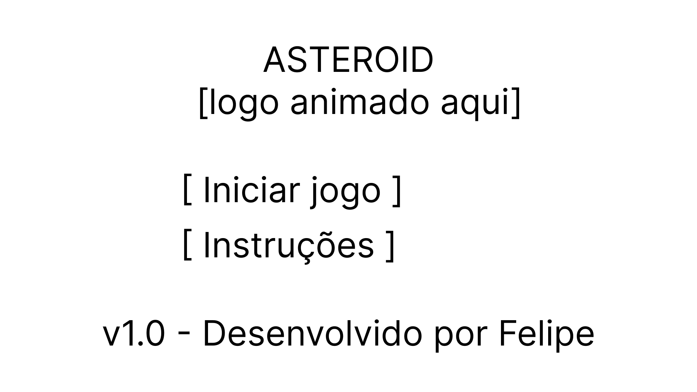
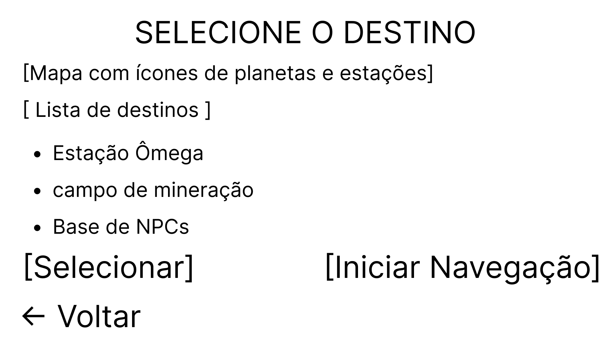
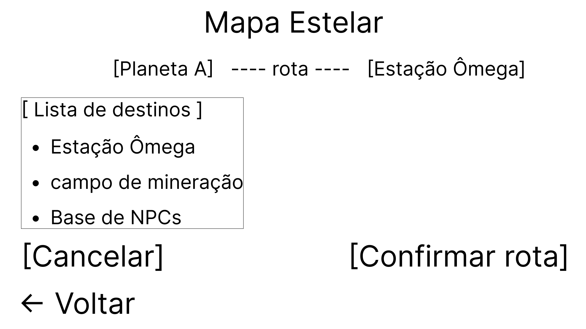

# Projeto de Interface

Visão geral da interação do usuário pelas telas do sistema e protótipo interativo das telas com as funcionalidades que fazem parte do sistema (wireframes).

Apresente as principais interfaces da plataforma. Discuta como ela foi elaborada de forma a atender os requisitos funcionais, não funcionais e histórias de usuário abordados nas <a href="2-Especificação do Projeto.md"> Documentação de Especificação</a>.

## Diagrama de Fluxo

O diagrama apresenta o estudo do fluxo de interação do usuário com o sistema interativo e muitas vezes sem a necessidade do desenho do design das telas da interface. Isso permite que o design das interações seja bem planejado e gere impacto na qualidade no design do wireframe interativo que será desenvolvido logo em seguida.

    

## Wireframes / Prototipos /App

|Nome                            |Wireframe   |
| --                             | --         |
| Tela inicial - Asteroid_Jogo   ||
| Dashboard                      ||            
| Tela de Navegação              ||
| Tela de Interação com NPCs     ||
| Tela de Upgrade                ||
| Tela de Notificações           ||
| Tela de Pagamento/Conversão    ||
 
